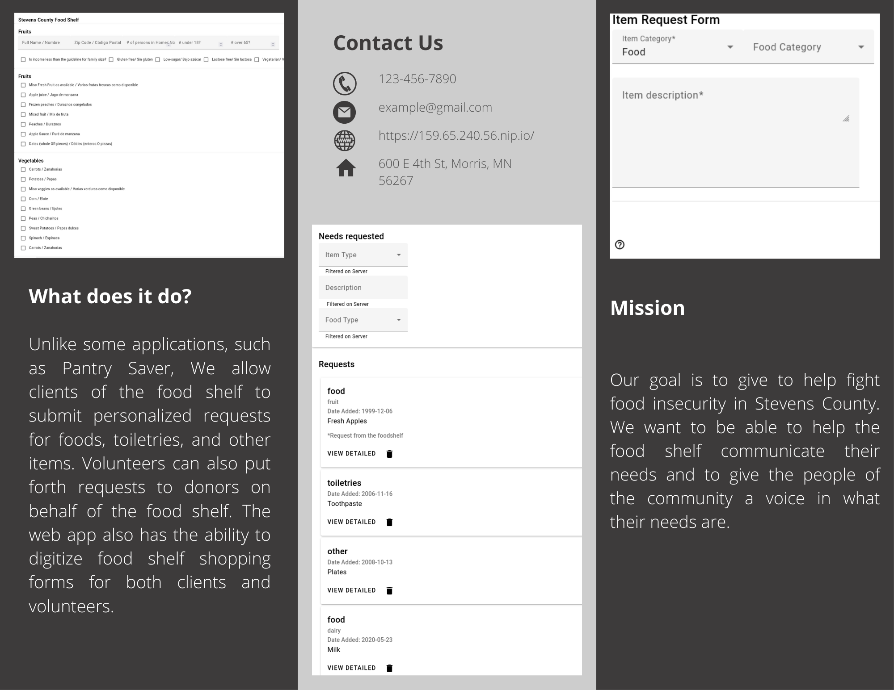

# CSCI 3601 Iteration Template <!-- omit in toc -->

- [What is PocketShelf?](#what-is-pocketshelf)
- [How to use PocketShelf](#how-to-use-pocketshelf)
- [Issues and to-dos](#issues-and-to-dos)
  - [Development](#development)
    - [Common commands](#common-commands)
  - [Deployment](#deployment)
  - [Resources](#resources)
  - [Contributors](#contributors)
  - [Changing the name](#changing-the-name)

# What is PocketShelf?
PocketShelf is an app that makes the process of requesting and donating food and other products to the food shelf easy and convenient. 

This app allows people who rely on the food shelf to easily and conveniently make requests for their various needs to the food shelf. 

This app also allows volunteers who work at the food shelf to more easily see what people are requesting and to add requests themselves for items that the food shelf needs but no one made a specific request for.   

Finally this app allows people who want to donate to the food shelf the ability to easily see the needs of the food shelf providing them an easy way to make sure that they are making a meaningful donation. 

# How to use PocketShelf
PocketShelf is broken down to five main parts. The home page, Client page, volunteer page, grocery form, and donor page. at the top of each page there are navigation buttons for each page.

The home page currently displays the title of our project along with a link to the food shelf's official website. in the future this page could also be used to display other relevant information.  

The client page is for people who want to request food and/or other products from the food shelf. clients have two ways to request items. the first one is the client page.the client page has a request form that asks them to fill out the items category. If they choose the food category they can also choose the category that the food belongs to but this part is optional. finally, they say the food that they want to request in the item description box. there they can go into more detail about the item they want. for example, if they want a specific brand. 

The second way for clients to request items is through the grocery form. the grocery form page has a digital version of the request form that clients would normally fill out in person. after a client fills out the form and submit it, the form is sent to the view form page where it can be more easily viewed. 

The volunteer page is for the people working at the food shelf. at the top of this page there is a "Needs requested" section. these fields allow volunteers to filter requests by item type, description, and food type. this page also allows volunteers to see requests made by clients. On each request there is an "Edit Request", "Post", and "Delete" button. this allows volunteers to edit requests in case it contains errors, post the request to the donor page for donors to fill the request, or delete the request in case it is not needed or not a legit request. at the bottom of the page there is a request form for the volunteers to make requests to donors themselves. 

finally, there is a donor page that shows all the requests posted by the volunteers. on the requests it shows if it came from a client or the food shelf itself. if a volunteer is on the donor page they can delete requests that are no longer needed. 

# Issues and to-dos
- Make it so only volunteers can see the view form page.
- Make it so the view form page only shows what the client filled out. 
- Clean up the request form page.
- Google authentication.
- link to full list of issues and todos https://docs.google.com/document/d/1GsxLsKFngpfIdW6_--EInzTerLmo_a2VjopoMJbDjdI/edit?usp=sharing

## [Development](DEVELOPMENT.md)

Instructions on setting up the development environment and working with the code are in [the development guide](DEVELOPMENT.md).

### Common commands

From the `server` directory:

- `./gradlew run` to start the server
- `./gradlew test` to test the server
- `./gradlew checkstyleMain` to run Checkstyle on the server Java code in the `src/main` folder
- `./gradlew checkstyleTest` to run Checkstyle on the server Java code in the `src/test` folder
- `./gradlew check` will run the tests, run the Checkstyle checks, and generate coverage reports in one command

From the `client` directory:

- `ng serve` to run the client
- `ng test` to test the client
  - Or `ng test --no-watch --code-coverage` to run the client tests once and
    also compute the code coverage.
- `ng e2e` and `ng e2e --watch` to run end-to-end tests

From the `database` directory:

- `./mongoseed.sh` (or `.\mongoseed.bat` on Windows) to seed the database

## [Deployment](DEPLOYMENT.md)

Instructions on how to create a DigitalOcean Droplet to host the project on and deploy can be found here in [the deployment guide](DEPLOYMENT.md).

Additionally, it is necessary to "fake" authentication for the partial implementation currently in place. Authentication can be achieved by accessing `/api/auth` via a GET request. This sets a cookie which is used to prove verification to the server.

## [Resources](RESOURCES.md)

Additional resources on tooling and techniques are in [the resources list](RESOURCES.md).

## Contributors

The contributors to this project can be seen [here](../../graphs/contributors).
<!-- ALL-CONTRIBUTORS-LIST:START - Do not remove or modify this section -->
<!-- prettier-ignore-start -->
<!-- markdownlint-disable -->
<table>
  <tr>
    <td align="center"><a href="https://floogulinc.com/"> <b>Paul Friederichsen</b></a> <a href="https://github.com/UMM-CSci-3601/3601-iteration-template/commits?author=floogulinc" title="Code">💻</a> <a href="#content-floogulinc" title="Content">🖋</a> <a href="https://github.com/UMM-CSci-3601/3601-iteration-template/commits?author=floogulinc" title="Documentation">📖</a> <a href="#ideas-floogulinc" title="Ideas, Planning, & Feedback">🤔</a> <a href="#mentoring-floogulinc" title="Mentoring">🧑‍🏫</a> <a href="#question-floogulinc" title="Answering Questions">💬</a> <a href="https://github.com/UMM-CSci-3601/3601-iteration-template/pulls?q=is%3Apr+reviewed-by%3Afloogulinc" title="Reviewed Pull Requests">👀</a> <a href="#security-floogulinc" title="Security">🛡️</a> <a href="https://github.com/UMM-CSci-3601/3601-iteration-template/commits?author=floogulinc" title="Tests">⚠️</a> <a href="#a11y-floogulinc" title="Accessibility">️️️️♿️</a> <a href="#infra-floogulinc" title="Infrastructure (Hosting, Build-Tools, etc)">🚇</a> <a href="#maintenance-floogulinc" title="Maintenance">🚧</a></td>
    <td align="center"><a href="https://github.com/helloworld12321"> <b>Joe Moonan Walbran</b></a> <a href="https://github.com/UMM-CSci-3601/3601-iteration-template/issues?q=author%3Ahelloworld12321" title="Bug reports">🐛</a> <a href="https://github.com/UMM-CSci-3601/3601-iteration-template/commits?author=helloworld12321" title="Code">💻</a> <a href="#content-helloworld12321" title="Content">🖋</a> <a href="https://github.com/UMM-CSci-3601/3601-iteration-template/commits?author=helloworld12321" title="Documentation">📖</a> <a href="#ideas-helloworld12321" title="Ideas, Planning, & Feedback">🤔</a> <a href="#infra-helloworld12321" title="Infrastructure (Hosting, Build-Tools, etc)">🚇</a> <a href="#maintenance-helloworld12321" title="Maintenance">🚧</a> <a href="#mentoring-helloworld12321" title="Mentoring">🧑‍🏫</a> <a href="#projectManagement-helloworld12321" title="Project Management">📆</a> <a href="#question-helloworld12321" title="Answering Questions">💬</a> <a href="https://github.com/UMM-CSci-3601/3601-iteration-template/pulls?q=is%3Apr+reviewed-by%3Ahelloworld12321" title="Reviewed Pull Requests">👀</a> <a href="#tool-helloworld12321" title="Tools">🔧</a> <a href="https://github.com/UMM-CSci-3601/3601-iteration-template/commits?author=helloworld12321" title="Tests">⚠️</a></td>
    <td align="center"><a href="https://github.com/kklamberty"> <b>K.K. Lamberty</b></a> <a href="https://github.com/UMM-CSci-3601/3601-iteration-template/commits?author=kklamberty" title="Code">💻</a> <a href="#content-kklamberty" title="Content">🖋</a> <a href="#design-kklamberty" title="Design">🎨</a> <a href="https://github.com/UMM-CSci-3601/3601-iteration-template/commits?author=kklamberty" title="Documentation">📖</a> <a href="#ideas-kklamberty" title="Ideas, Planning, & Feedback">🤔</a> <a href="#mentoring-kklamberty" title="Mentoring">🧑‍🏫</a> <a href="#projectManagement-kklamberty" title="Project Management">📆</a> <a href="#question-kklamberty" title="Answering Questions">💬</a> <a href="https://github.com/UMM-CSci-3601/3601-iteration-template/commits?author=kklamberty" title="Tests">⚠️</a> <a href="#tutorial-kklamberty" title="Tutorials">✅</a> <a href="#a11y-kklamberty" title="Accessibility">️️️️♿️</a></td>
    <td align="center"><a href="http://www.morris.umn.edu/~mcphee"> <b>Nic McPhee</b></a> <a href="#infra-NicMcPhee" title="Infrastructure (Hosting, Build-Tools, etc)">🚇</a> <a href="https://github.com/UMM-CSci-3601/3601-iteration-template/commits?author=NicMcPhee" title="Tests">⚠️</a> <a href="https://github.com/UMM-CSci-3601/3601-iteration-template/issues?q=author%3ANicMcPhee" title="Bug reports">🐛</a> <a href="#content-NicMcPhee" title="Content">🖋</a> <a href="https://github.com/UMM-CSci-3601/3601-iteration-template/commits?author=NicMcPhee" title="Documentation">📖</a> <a href="#design-NicMcPhee" title="Design">🎨</a> <a href="#maintenance-NicMcPhee" title="Maintenance">🚧</a> <a href="#projectManagement-NicMcPhee" title="Project Management">📆</a> <a href="#question-NicMcPhee" title="Answering Questions">💬</a> <a href="https://github.com/UMM-CSci-3601/3601-iteration-template/pulls?q=is%3Apr+reviewed-by%3ANicMcPhee" title="Reviewed Pull Requests">👀</a> <a href="https://github.com/UMM-CSci-3601/3601-iteration-template/commits?author=NicMcPhee" title="Code">💻</a></td>
  </tr>
</table>

<!-- markdownlint-restore -->
<!-- prettier-ignore-end -->

<!-- ALL-CONTRIBUTORS-LIST:END -->

## Changing the name

The project by default has the name "CSCI 3601 Iteration Template". There are a few places you need to change to make this the name you want:

- The title in this README.md
- [`client/src/app/app.component.ts`](client/src/app/app.component.ts)
  - The `title` variable
  - Also the associated unit and E2E tests will need to be changed.
- [`client/src/app/app.component.html`](client/src/app/app.component.html)
  - The `mat-toolbar` element for the navigation drawer is just "Client" by default.
- [`client/src/index.html`](client/src/index.html)
  - The `title` element

You can go ahead and remove this section of the README once you have changed the name.
